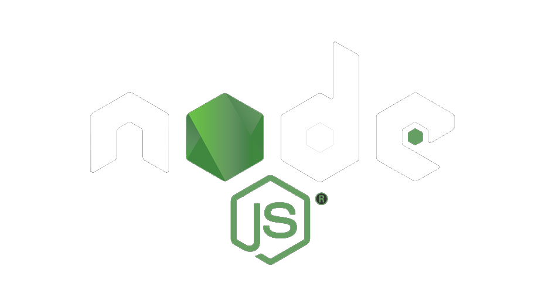
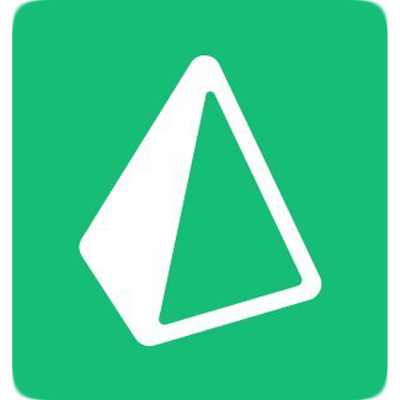

### Howdy Devs !!!

  
    
  <samp>
    I'm <a href="https://www.linkedin.com/in/jobin-biju-55b034179/">Jobin</a>, an aspiring software & hardware developer:computer:. Interested in working on Fontend Dev, IoT and Application Dev using Flutter. I'm always curious about new technologies and love to build awesome user experiences with software & frameworks.
  </samp>

### Programming Languages

  

 
 
 

### Frameworks/Tools

  

 
 
 

### Design tools I use

  

 
 
 

### Get in touch

[][whatsapp]
[][linkedin]
[][instagram]
[][website]

 
 

### My Stats

 

 

 

 
 
  

  
 
 

[whatsapp]: https://wa.me/918281392010/
[website]: https://jobin-biju.vercel.app/
[instagram]: https://www.instagram.com/jobz.sneezer/
[linkedin]: https://www.linkedin.com/in/jobin-biju-55b034179

